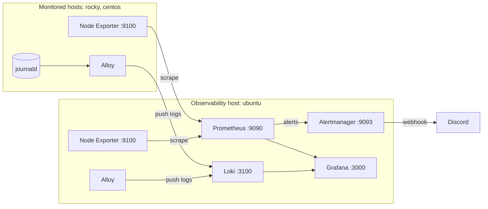

# Ansible Observability Lab

Ansible automation that deploys a complete observability stack (metrics, logs, dashboards, and alerting) across a small mixed Linux fleet: **Ubuntu**, **Rocky Linux**, and **CentOS**.

One inventory and a set of role-based playbooks take three fresh hosts to a working pipeline: Node Exporter and Prometheus for metrics, Grafana Alloy and Loki for logs, Grafana for dashboards, and Alertmanager for Discord notifications.

## Stack

| Component | Version | Runs on | Purpose |
| --- | --- | --- | --- |
| Node Exporter | 1.10.2 | all hosts | Host metrics (port 9100) |
| Grafana Alloy | latest from Grafana repo | all hosts | Ships systemd journal logs to Loki |
| systemd-journald | n/a | all hosts | Persistent journal storage |
| Prometheus | 3.8.1 | observability host | Metrics scraping and alert rules (port 9090) |
| Alertmanager | 0.28.1 | observability host | Alert routing to Discord (port 9093) |
| Loki | 3.5.5 | observability host | Central log storage (port 3100) |
| Grafana | latest from Grafana repo | observability host | Dashboards and log exploration (port 3000) |

## Architecture



## Inventory

| Host | Group | IP | Role in the lab |
| --- | --- | --- | --- |
| `ubuntu` | `observability` | 192.168.0.30 | Runs the server components (Prometheus, Alertmanager, Loki, Grafana) |
| `rocky` | `monitored` | 192.168.0.10 | Monitored host (RHEL family) |
| `centos` | `monitored` | 192.168.0.20 | Monitored host (RHEL family) |

Agent playbooks (bootstrap, journald, Node Exporter, Alloy) target every host. Server playbooks target only the `observability` group. Prometheus scrape targets and each host's `/etc/hosts` are generated from the inventory, so adding a host there is enough for it to be monitored.

## Repository structure

```
ansible-observability-lab/
├── README.md
├── docs/                     # screenshots captured during development
└── ansible/
    ├── ansible.cfg
    ├── requirements.yml      # collection dependencies
    ├── site.yml              # runs every playbook in dependency order
    ├── inventory/
    │   ├── hosts.yml
    │   ├── group_vars/
    │   │   ├── all.yml
    │   │   └── observability.yml   # Ansible Vault (encrypted secrets)
    │   └── host_vars/        # per-host hostname and IP variables
    ├── playbooks/
    │   ├── bootstrap.yml
    │   ├── journald.yml
    │   ├── node_exporter.yml
    │   ├── loki.yml
    │   ├── prometheus.yml
    │   ├── alertmanager.yml
    │   ├── grafana.yml
    │   └── alloy.yml
    └── roles/
        ├── bootstrap/
        ├── journald/
        ├── node_exporter/
        ├── alloy/
        ├── loki/
        ├── prometheus/
        ├── alertmanager/
        └── grafana/
```

Each role follows the standard layout (`tasks/`, `defaults/`, `handlers/`, `templates/`), and every service restart is driven by a handler so services restart only when their configuration or binary changes.

## Roles

| Role | Targets | What it does |
| --- | --- | --- |
| `bootstrap` | all | Installs baseline packages, sets the hostname, builds `/etc/hosts` from the inventory, creates working directories, and enables the host firewall (`firewalld` or `ufw`) with SSH allowed |
| `journald` | all | Enables persistent journal storage with size limits (1G persistent, 200M runtime) |
| `node_exporter` | all | Installs the release binary under a dedicated system user with a systemd unit, and opens port 9100 |
| `alloy` | all | Adds the Grafana package repo for the OS family, installs Alloy, grants it journal access, and deploys a config that reads the journal and pushes to Loki |
| `loki` | observability | Installs Loki as a systemd service with filesystem storage and opens port 3100 |
| `prometheus` | observability | Installs Prometheus and `promtool`, generates scrape targets from the inventory, and deploys alert rules and the Alertmanager connection |
| `alertmanager` | observability | Installs Alertmanager and `amtool` and routes alerts to a Discord webhook |
| `grafana` | observability | Installs Grafana from the official APT repo, sets the admin password, disables sign-up and telemetry, and provisions Prometheus and Loki as data sources |

### Cross-distro handling

The same roles work on Debian-family and RHEL-family hosts by branching on `ansible_facts.os_family`:

- **Package repositories:** `deb822_repository` and `apt` on Ubuntu, `yum_repository` and `dnf` on Rocky and CentOS
- **Firewall:** `ufw` on Ubuntu, `firewalld` on Rocky and CentOS
- **CPU architecture:** the `amd64` or `arm64` release build is chosen automatically from `ansible_facts['architecture']`, so the lab runs on x86_64 and ARM hosts alike

### Alerting

A starter rule, `NodeExporterDown`, fires at critical severity when any Node Exporter target is unreachable for one minute. Alertmanager delivers it to Discord, including a resolved notification when the target recovers.

### Logs

Alloy reads the systemd journal (the last 12 hours on startup) and pushes entries to Loki, labelled with `host` (the inventory hostname) and `component="journald"`.

## Requirements

- **Control node:** `ansible-core` 2.15 or newer (the roles use `deb822_repository`)
- **Collections:**
  ```bash
  ansible-galaxy collection install -r requirements.yml
  ```
- **Targets:** Ubuntu, Rocky Linux, and CentOS hosts reachable over SSH, with internet access to download release binaries from GitHub and packages from Grafana's repositories
- **Architecture:** x86_64 and aarch64 are both supported

## Secrets

Secrets live in an Ansible Vault file, `inventory/group_vars/observability.yml`. It must define:

| Variable | Used by | Notes |
| --- | --- | --- |
| `alertmanager_discord_webhook_url` | `alertmanager` | Discord webhook for alert notifications |
| `grafana_admin_password` | `grafana` | At least 12 characters and not `admin`; the play refuses to run without it |

`ansible.cfg` reads the vault password from `~/.ansible/vault_password`. To use your own secrets:

```bash
mkdir -p ~/.ansible
echo 'your-vault-password' > ~/.ansible/vault_password
chmod 600 ~/.ansible/vault_password

ansible-vault create inventory/group_vars/observability.yml   # or `ansible-vault edit` if it exists
# add:  alertmanager_discord_webhook_url: "https://discord.com/api/webhooks/..."
#       grafana_admin_password: "a-long-unique-password"
```

The `grafana` role sets the admin password through `grafana.ini` on fresh installs, and also through Grafana's API, so an existing install still using the default `admin/admin` login is updated on the next run.

## Usage

```bash
git clone https://github.com/OB-Adams/ansible-observability-lab.git
cd ansible-observability-lab/ansible

# Check connectivity
ansible all -m ping
```

Run everything in dependency order with one command:

```bash
ansible-playbook site.yml
```

Or run the playbooks one at a time, in this order:

```bash
ansible-playbook playbooks/bootstrap.yml       # 1. baseline, hostnames, firewalls
ansible-playbook playbooks/journald.yml        # 2. persistent journal
ansible-playbook playbooks/node_exporter.yml   # 3. metrics agent on every host
ansible-playbook playbooks/loki.yml            # 4. log store
ansible-playbook playbooks/prometheus.yml      # 5. metrics server and alert rules
ansible-playbook playbooks/alertmanager.yml    # 6. Discord alerting
ansible-playbook playbooks/grafana.yml         # 7. dashboards and data sources
ansible-playbook playbooks/alloy.yml           # 8. log shipping on every host
```

Loki should be up before Alloy so logs have somewhere to go. Every playbook is safe to re-run.

## Verification

| Check | Command or URL |
| --- | --- |
| Service status | `systemctl status node_exporter alloy` (all hosts); `systemctl status prometheus loki alertmanager grafana-server` (ubuntu) |
| Prometheus targets | `http://192.168.0.30:9090/targets`, all three `node` targets should be UP |
| Loki ready | `curl http://192.168.0.30:3100/ready` |
| Alertmanager | `http://192.168.0.30:9093` |
| Grafana | `http://192.168.0.30:3000`, log in as `admin` with your vaulted password; both data sources are provisioned |
| Default login rejected | `curl -s -o /dev/null -w "%{http_code}" -u admin:admin http://192.168.0.30:3000/api/user` returns `401` |
| Logs in Grafana (Explore, Loki) | `{component="journald", host="rocky"}` |
| Test the alert | `sudo systemctl stop node_exporter` on a host, wait about a minute, and check Discord |

## Deployment walkthrough

Screenshots captured while building and testing the lab, in run order.

### 1. Connectivity and baseline


### 2. Metrics


### 3. Logs


### 4. Dashboards and alerting


### 5. Idempotency


<details>
<summary>More screenshots</summary>

| Stage | Screenshots |
| --- | --- |
| Bootstrap | [baseline](docs/bootstrap-baseline.png), [host configuration](docs/bootstrap-host-configuration.png), [idempotency](docs/bootstrap-idempotency.png) |
| Journald | [deployment](docs/journald-ansible-deployment.png), [configuration](docs/journald-configuration.png) |
| Node Exporter | [firewall port](docs/node-exporter-firewall-port.png), [idempotency](docs/node-exporter-idempotency.png) |
| Loki | [deployment](docs/loki-ansible-deployment.png) |
| Prometheus | [deployment](docs/prometheus-ansible-deployment.png), [configuration](docs/prometheus-configuration.png) |
| Alertmanager | [deployment](docs/alertmanager-deployment.png) |
| Grafana | [deployment](docs/grafana-deployment.png) |
| Alloy | [deployment](docs/alloy-ansible-deployment.png), [configuration](docs/alloy-configuration.png), [Loki configuration](docs/alloy-loki-configuration.png), [service](docs/alloy-service.png), [idempotency](docs/alloy-ansible-idempotency.png) |

</details>

## Design notes and limitations

This is a lab project, and some choices reflect that:

- **SSH as root** with `host_key_checking = False`, which is convenient for throwaway VMs. A real deployment would use a non-root user with `become` and verified host keys.
- **Static lab IPs.** Host addresses come from the inventory, but the Alloy role's `alloy_loki_endpoint` default still points at `192.168.0.30`. If the observability host's IP changes, override that variable in `group_vars/all.yml`.
- **Grafana** listens on all interfaces over plain HTTP. Put it behind a reverse proxy with TLS before exposing it beyond a trusted network.
- **Downloaded release archives are not checksum-verified**, and Prometheus, Loki, and Alertmanager configs are not validated before a service restarts.
- **Loki upgrades:** the extract step is guarded by a filename that does not include the version, so changing `loki_version` alone will not replace an already-installed binary.

## Roadmap

- Verify release downloads against the projects' published SHA-256 checksums
- Validate configs with `promtool`, `amtool`, and Loki's `-verify-config` before they replace the live file
- Derive the Alloy Loki endpoint from the inventory instead of a default IP
- Make Loki binary upgrades version-aware
- Add `ansible-lint` and Molecule tests, plus a CI workflow
- Provision Grafana dashboards as code

## Skills demonstrated

- Role-based Ansible with handlers, templates, defaults, and Vault
- Managing a mixed Debian and RHEL fleet from one codebase, including CPU architecture detection
- Installing software from release tarballs and vendor repositories with dedicated system users and systemd units
- Host firewall automation (`ufw` and `firewalld`)
- End-to-end integration of Prometheus, Alertmanager, Loki, Alloy, and Grafana
- Securing a default-credential service with Vault-managed secrets and an idempotent API-based password change

## Author

**Ebenezer Obiri Adams** ([@OB-Adams](https://github.com/OB-Adams))
