# Ansible Observability Lab

[](https://github.com/OB-Adams/ansible-observability-lab/actions/workflows/ansible-ci.yml)

Ansible automation that deploys a complete observability stack (metrics, logs, dashboards, and alerting) across a small mixed Linux fleet: **Ubuntu**, **Rocky Linux**, and **CentOS**.

One inventory and a set of role-based playbooks take three fresh hosts to a working pipeline: Node Exporter and Prometheus for metrics, Grafana Alloy and Loki for logs, Grafana for dashboards, and Alertmanager for Discord notifications. Release downloads are checksum-verified, and service configuration is validated before it replaces a live file.

## Stack

| Component | Version | Runs on | Purpose |
| --- | --- | --- | --- |
| Node Exporter | 1.10.2 | all hosts | Host metrics (port 9100) |
| Grafana Alloy | latest from Grafana repo | all hosts | Ships systemd journal logs to Loki |
| systemd-journald | n/a | all hosts | Persistent journal storage |
| Prometheus | 3.15.0 | observability host | Metrics scraping and alert rules (port 9090) |
| Alertmanager | 0.28.1 | observability host | Alert routing to Discord (port 9093) |
| Loki | 3.7.7 | observability host | Central log storage (port 3100) |
| Grafana | latest from Grafana repo | observability host | Dashboards and log exploration (port 3000) |

## Architecture

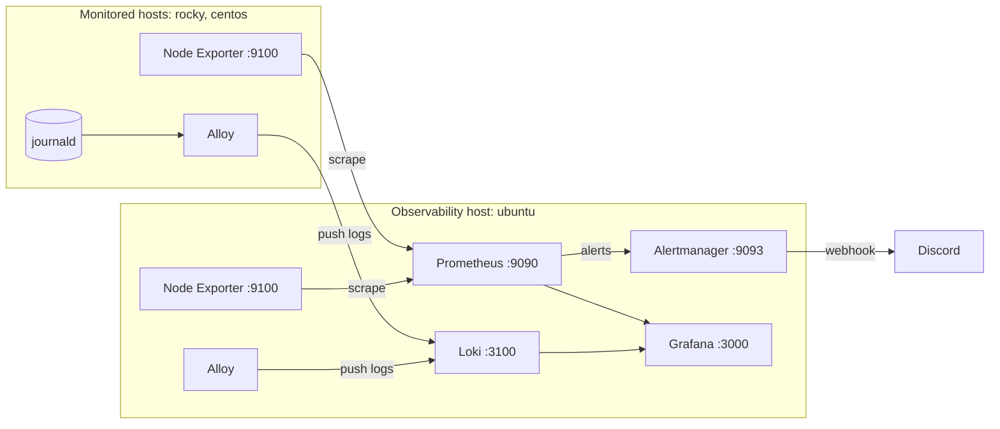

## Inventory

| Host | Group | IP | Role in the lab |
| --- | --- | --- | --- |
| `ubuntu` | `observability` | 192.168.0.30 | Runs the server components (Prometheus, Alertmanager, Loki, Grafana) |
| `rocky` | `monitored` | 192.168.0.10 | Monitored host (RHEL family) |
| `centos` | `monitored` | 192.168.0.20 | Monitored host (RHEL family) |

Agent playbooks (bootstrap, journald, Node Exporter, Alloy) target every host. Server playbooks target only the `observability` group. Prometheus scrape targets and each host's `/etc/hosts` are generated from the inventory, so adding a host there is enough for it to be monitored. The address agents use to reach Loki comes from one inventory variable, `observability_host` in `inventory/hosts.yml`.

## Repository structure

```
ansible-observability-lab/
├── README.md
├── .github/
│   └── workflows/
│       └── ansible-ci.yml    # GitHub Actions: syntax checks on every push and PR
├── docs/                     # screenshots captured during development
└── ansible/
    ├── ansible.cfg
    ├── requirements.yml      # collection dependencies
    ├── site.yml              # runs every playbook in dependency order
    ├── inventory/
    │   ├── hosts.yml         # hosts, groups, and observability_host
    │   ├── group_vars/
    │   │   ├── all.yml
    │   │   └── observability.yml   # Ansible Vault (encrypted secrets)
    │   └── host_vars/        # per-host hostname and IP variables
    ├── playbooks/
    │   ├── bootstrap.yml
    │   ├── journald.yml
    │   ├── node_exporter.yml
    │   ├── loki.yml
    │   ├── prometheus.yml
    │   ├── alertmanager.yml
    │   ├── grafana.yml
    │   └── alloy.yml
    └── roles/
        ├── bootstrap/
        ├── journald/
        ├── node_exporter/
        ├── alloy/
        ├── loki/
        ├── prometheus/
        ├── alertmanager/
        └── grafana/
```

Each role follows the standard layout (`tasks/`, `defaults/`, `handlers/`, `templates/`), and every service restart is driven by a handler so services restart only when their configuration or binary changes.

## Roles

| Role | Targets | What it does |
| --- | --- | --- |
| `bootstrap` | all | Installs baseline packages, sets the hostname, builds `/etc/hosts` from the inventory, creates working directories, and enables the host firewall (`firewalld` or `ufw`) with SSH allowed |
| `journald` | all | Enables persistent journal storage with size limits (1G persistent, 200M runtime) |
| `node_exporter` | all | Verifies and installs the release binary under a dedicated system user with a systemd unit, and opens port 9100 |
| `alloy` | all | Adds the Grafana package repo for the OS family, installs Alloy, grants it journal access, and deploys a config that reads the journal and pushes to Loki |
| `loki` | observability | Verifies and installs Loki into a version-specific release directory, validates its configuration before deployment, opens port 3100, and restarts the service when the binary or configuration changes |
| `prometheus` | observability | Verifies and installs Prometheus and `promtool`, generates scrape targets from the inventory, deploys alert rules, and validates its configuration before deployment |
| `alertmanager` | observability | Verifies and installs Alertmanager and `amtool`, validates its configuration before deployment, and routes alerts to a Discord webhook |
| `grafana` | observability | Installs Grafana from the official APT repo, sets the admin password, disables sign-up and telemetry, and provisions Prometheus and Loki as data sources |

### Cross-distro handling

The same roles work on Debian-family and RHEL-family hosts by branching on `ansible_facts.os_family`:

- **Package repositories:** `deb822_repository` and `apt` on Ubuntu, `yum_repository` and `dnf` on Rocky and CentOS
- **Firewall:** `ufw` on Ubuntu, `firewalld` on Rocky and CentOS
- **CPU architecture:** the `amd64` or `arm64` release build is chosen automatically from `ansible_facts['architecture']`, so the lab runs on x86_64 and ARM hosts alike

### Alerting

A starter rule, `NodeExporterDown`, fires at critical severity when any Node Exporter target is unreachable for one minute. Alertmanager delivers it to Discord, including a resolved notification when the target recovers.

### Logs

Alloy reads the systemd journal (the last 12 hours on startup) and pushes entries to Loki, labelled with `host` (the inventory hostname) and `component="journald"`.

## Safety checks

Two checks protect the stack from bad inputs: downloads are verified before they are installed, and configuration is validated before it replaces a live file.

### Release archive checksum verification

Release archives for all four downloaded components (Node Exporter, Prometheus, Alertmanager, Loki) are verified against SHA-256 checksums published by the upstream project, and are extracted only after verification succeeds.

- **Node Exporter, Prometheus, and Alertmanager:**
  1. Download the official `sha256sums.txt` manifest for the pinned version.
  2. Extract the checksum for the exact archive name (version and architecture).
  3. Assert that a well-formed 64-character SHA-256 value was found.
  4. Download the archive with Ansible's `checksum` verification enabled.
  5. Extract the archive only if the checksum matched.
- **Loki:** the expected digest is read from the GitHub release metadata for the pinned version (the asset's SHA-256 `digest`), validated for format, and used to verify the download.

A missing checksum entry or a mismatched download stops the play before anything is installed.

### Configuration validation

Prometheus, Loki, and Alertmanager each validate their rendered configuration with the service's own tooling before it is deployed:

| Service | Validation command |
| --- | --- |
| Prometheus | `promtool check config` |
| Loki | `loki -config.file=<candidate> -verify-config` |
| Alertmanager | `amtool check-config` |

The deployment process for each is:

1. Render the configuration template to a temporary candidate file, readable only by root (the Alertmanager config contains the Discord webhook).
2. Validate the candidate.
3. Copy the candidate over the active configuration only if validation succeeds.
4. Notify the restart handler only when the active configuration actually changed.
5. Remove the temporary candidate file.

If validation fails, Ansible stops before replacing the active configuration, so the running service keeps its last known good config and an invalid file never triggers a restart. For Prometheus, the alert rules file is deployed before the main configuration, because `promtool` checks that every referenced rule file exists.

Verify the result:

```bash
curl -fsS http://192.168.0.30:3100/ready                       # Loki ready
curl -fsS http://192.168.0.30:9093/-/healthy                   # Alertmanager healthy
ansible ubuntu -m command -a "/opt/alertmanager/amtool check-config /etc/alertmanager/alertmanager.yml"
promtool check config /etc/prometheus/prometheus.yml           # on the observability host
```

### Loki release directories

Loki is installed into a version-specific directory (`/opt/loki/releases/<version>`), and the active binary (`/opt/loki/loki`) is copied from it. Changing `loki_version` installs the new release alongside the old one, and the Loki handler restarts the service when the binary changes. Check the running version with:

```bash
sudo /opt/loki/loki -version
```

## Continuous integration

A GitHub Actions workflow (`.github/workflows/ansible-ci.yml`) runs on every push and pull request to `main`, and can be started manually. It:

1. Installs `ansible-core` and the collections in `requirements.yml`.
2. Writes the Vault password from the repository secret `ANSIBLE_VAULT_PASSWORD` to a temporary file.
3. Runs `ansible-playbook --syntax-check` on every playbook in `playbooks/` and on `site.yml`.
4. Removes the temporary password file, even if an earlier step failed.

The workflow checks syntax only: it does not lint the code or run the playbooks against hosts. To use it on a fork, add your own `ANSIBLE_VAULT_PASSWORD` secret under the repository's Actions secrets settings.

## Requirements

- **Control node:** `ansible-core` 2.15 or newer (the roles use `deb822_repository`)
- **Collections:**
  ```bash
  ansible-galaxy collection install -r requirements.yml
  ```
- **Targets:** Ubuntu, Rocky Linux, and CentOS hosts reachable over SSH, with internet access to download release binaries from GitHub and packages from Grafana's repositories
- **Architecture:** x86_64 and aarch64 are both supported

## Secrets

Secrets live in an Ansible Vault file, `inventory/group_vars/observability.yml`. It must define:

| Variable | Used by | Notes |
| --- | --- | --- |
| `alertmanager_discord_webhook_url` | `alertmanager` | Discord webhook for alert notifications |
| `grafana_admin_password` | `grafana` | At least 12 characters and not `admin`; the play refuses to run without it |

`ansible.cfg` does not set a Vault password file, so tell Ansible where the password is. The simplest way is an environment variable:

```bash
mkdir -p ~/.ansible
echo 'your-vault-password' > ~/.ansible/vault_password
chmod 600 ~/.ansible/vault_password
export ANSIBLE_VAULT_PASSWORD_FILE=~/.ansible/vault_password
```

Or pass `--vault-password-file ~/.ansible/vault_password` (or `--ask-vault-pass`) to each command. Then create the secrets file:

```bash
ansible-vault create inventory/group_vars/observability.yml   # or `ansible-vault edit` if it exists
# add:  alertmanager_discord_webhook_url: "https://discord.com/api/webhooks/..."
#       grafana_admin_password: "a-long-unique-password"
```

The `grafana` role sets the admin password through `grafana.ini` on fresh installs, and also through Grafana's API, so an existing install still using the default `admin/admin` login is updated on the next run.

## Usage

```bash
git clone https://github.com/OB-Adams/ansible-observability-lab.git
cd ansible-observability-lab/ansible

# Check connectivity
ansible all -m ping
```

Run everything in dependency order with one command:

```bash
ansible-playbook site.yml
```

Or run the playbooks one at a time, in this order:

```bash
ansible-playbook playbooks/bootstrap.yml       # 1. baseline, hostnames, firewalls
ansible-playbook playbooks/journald.yml        # 2. persistent journal
ansible-playbook playbooks/node_exporter.yml   # 3. metrics agent on every host
ansible-playbook playbooks/loki.yml            # 4. log store
ansible-playbook playbooks/prometheus.yml      # 5. metrics server and alert rules
ansible-playbook playbooks/alertmanager.yml    # 6. Discord alerting
ansible-playbook playbooks/grafana.yml         # 7. dashboards and data sources
ansible-playbook playbooks/alloy.yml           # 8. log shipping on every host
```

Loki should be up before Alloy so logs have somewhere to go. Every playbook is safe to re-run.

## Verification

| Check | Command or URL |
| --- | --- |
| Service status | `systemctl status node_exporter alloy` (all hosts); `systemctl status prometheus loki alertmanager grafana-server` (ubuntu) |
| Prometheus targets | `http://192.168.0.30:9090/targets`, all three `node` targets should be UP |
| Prometheus configuration | `promtool check config /etc/prometheus/prometheus.yml` on the observability host |
| Loki version | `sudo /opt/loki/loki -version` |
| Loki ready | `curl http://192.168.0.30:3100/ready` |
| Alertmanager | `http://192.168.0.30:9093` |
| Alertmanager health | `curl -fsS http://192.168.0.30:9093/-/healthy` |
| Alertmanager configuration | `/opt/alertmanager/amtool check-config /etc/alertmanager/alertmanager.yml` on the observability host |
| Grafana | `http://192.168.0.30:3000`, log in as `admin` with your vaulted password; both data sources are provisioned |
| Default login rejected | `curl -s -o /dev/null -w "%{http_code}" -u admin:admin http://192.168.0.30:3000/api/user` returns `401` |
| Logs in Grafana (Explore, Loki) | `{component="journald", host="rocky"}` |
| Test the alert | `sudo systemctl stop node_exporter` on a host, wait about a minute, and check Discord |

## Deployment walkthrough

Screenshots captured while building and testing the lab, in run order.

### 1. Connectivity and baseline

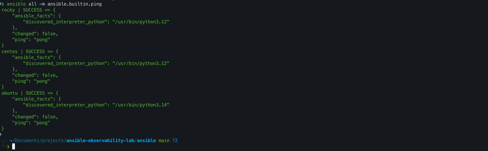

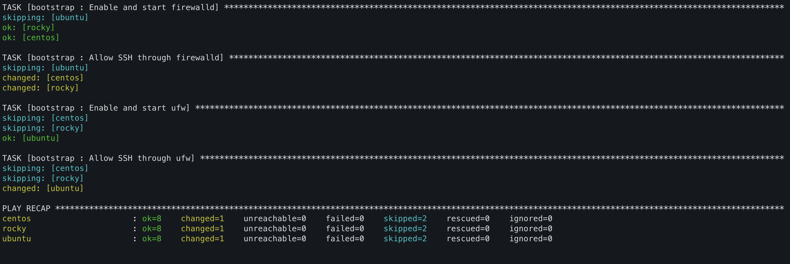

### 2. Metrics: Node Exporter and Prometheus

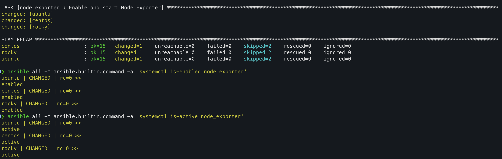

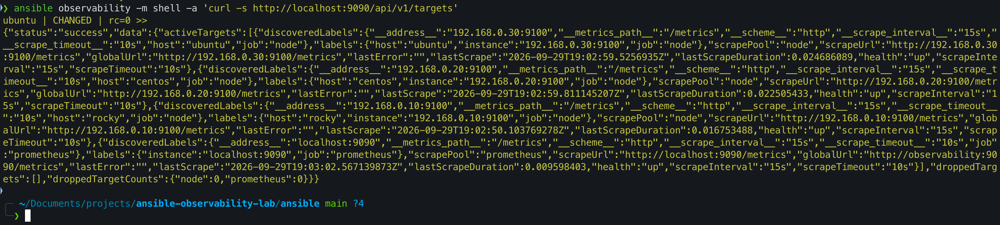

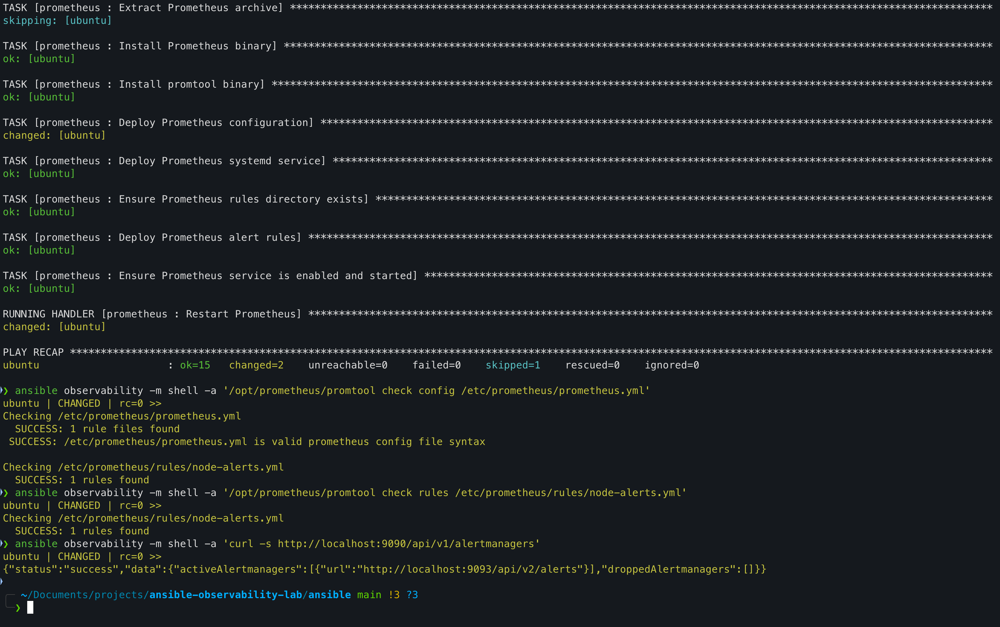

### 3. Logs: Loki and Alloy

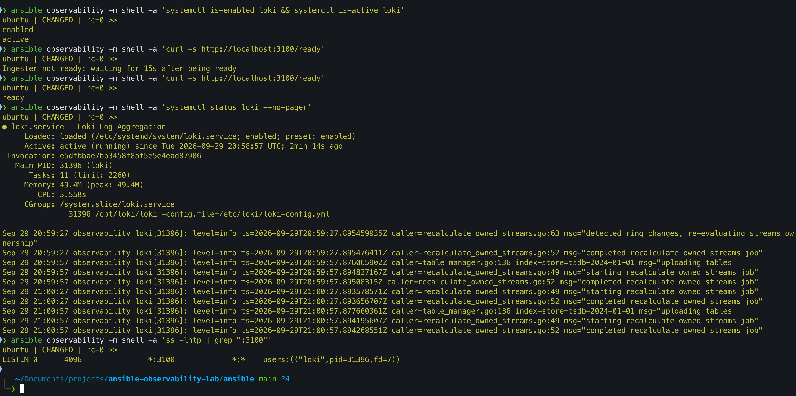

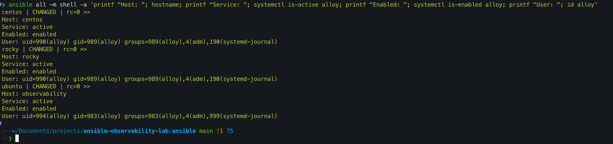

### 4. Dashboards and alerting: Grafana and Alertmanager

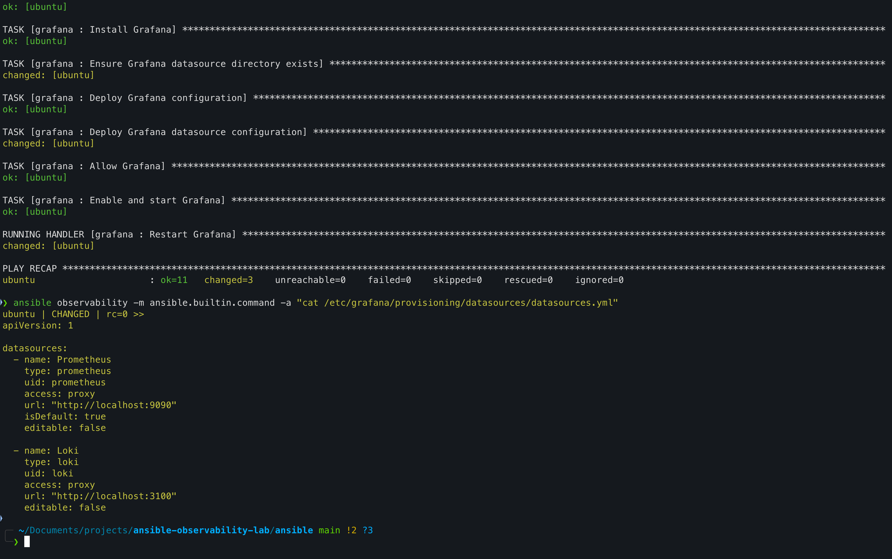

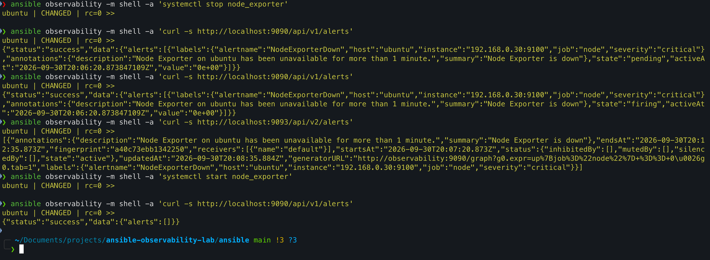

### 5. Safety checks in action

**Checksum verification:** a matching archive is accepted, and a mismatching one is rejected.

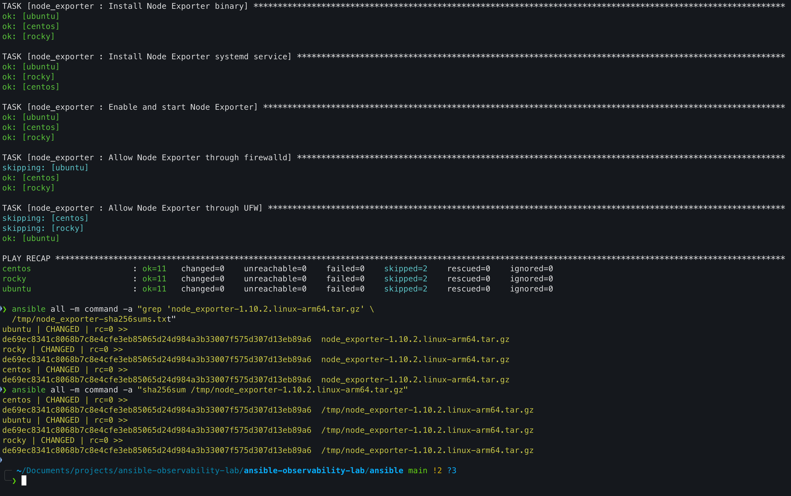

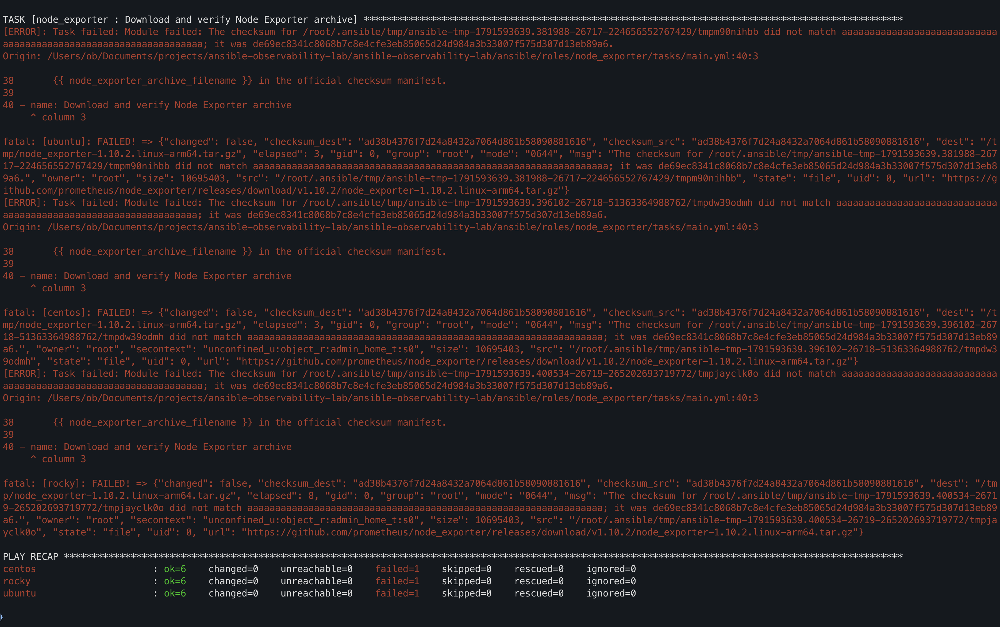

**Configuration validation:** a valid Prometheus configuration is deployed, and an invalid one is rejected before it reaches the live file.

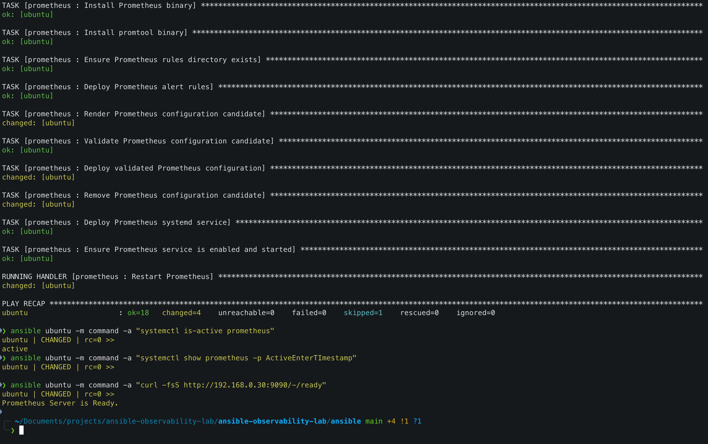

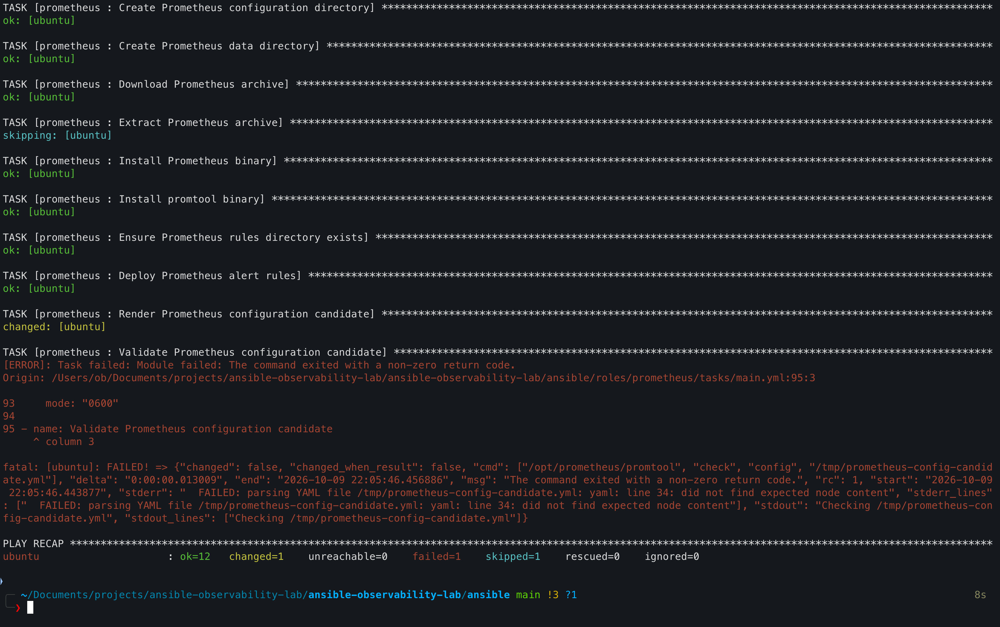

**Loki version change:** the pinned version is changed and the new release is installed.

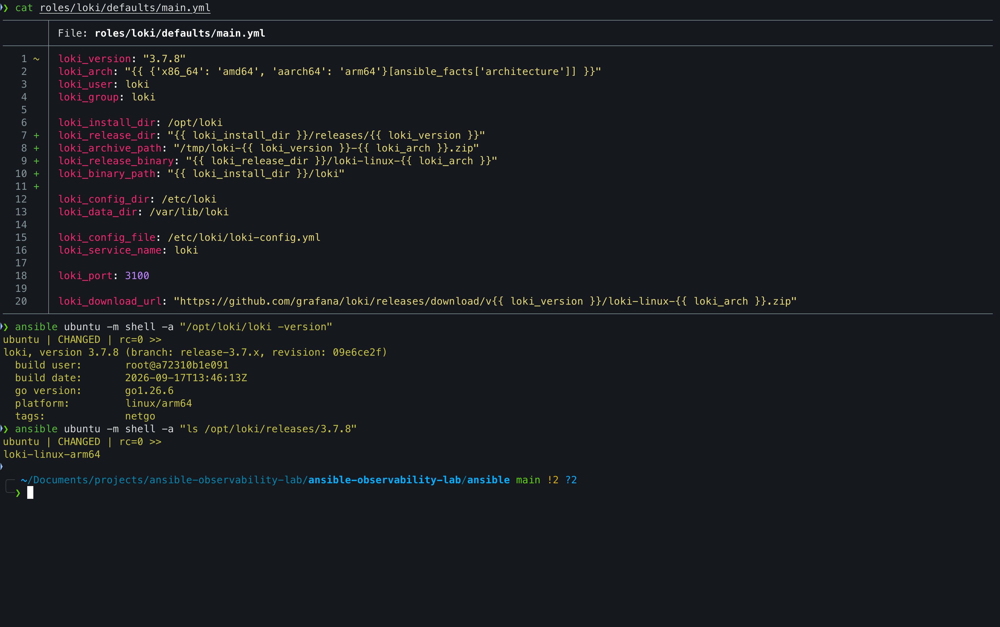

### 6. Idempotency

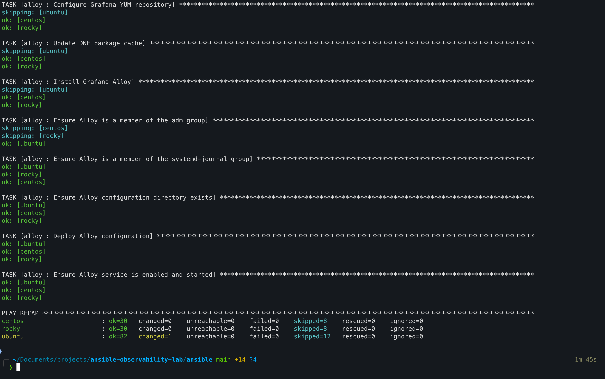

<details>
<summary>More screenshots</summary>

| Stage | Screenshots |
| --- | --- |
| Bootstrap | [baseline](docs/bootstrap-baseline.png), [host configuration](docs/bootstrap-host-configuration.png), [idempotency](docs/bootstrap-idempotency.png) |
| Journald | [deployment](docs/journald-ansible-deployment.png), [configuration](docs/journald-configuration.png) |
| Node Exporter | [firewall port](docs/node-exporter-firewall-port.png), [idempotency](docs/node-exporter-idempotency.png) |
| Loki | [deployment](docs/loki-ansible-deployment.png), [checksum verification](docs/loki-checksum-verification.png), [configuration validation](docs/loki-config-validation.png), [invalid configuration rejected](docs/loki-invalid-config-rejected.png) |
| Prometheus | [deployment](docs/prometheus-ansible-deployment.png), [configuration](docs/prometheus-configuration.png), [checksum verification](docs/prometheus-checksum-verification.png) |
| Alertmanager | [deployment](docs/alertmanager-deployment.png), [checksum verification](docs/alertmanager-checksum-verification.png), [configuration validation](docs/alertmanager-config-validation.png), [invalid configuration rejected](docs/alertmanager-invalid-config-rejected.png) |
| Grafana | [deployment](docs/grafana-deployment.png) |
| Alloy | [deployment](docs/alloy-ansible-deployment.png), [configuration](docs/alloy-configuration.png), [Loki configuration](docs/alloy-loki-configuration.png), [service](docs/alloy-service.png), [idempotency](docs/alloy-ansible-idempotency.png) |

</details>

## Design notes and limitations

This is a lab project, and some choices reflect that:

- **SSH as root** with `host_key_checking = False`, which suits throwaway VMs.
- **Grafana** listens on all interfaces over plain HTTP.
- **CI checks syntax only.** It does not lint the roles or run them against hosts.
- **One inventory address is repeated:** `observability_host` in `inventory/hosts.yml` is a literal IP that repeats the `ubuntu` host's `ansible_host`, so the two are kept in step by hand.
- **Loki's expected checksum comes from the GitHub API**, which rate-limits unauthenticated requests per address. Occasional lab runs are well within the limit.
- **One alert rule** (`NodeExporterDown`) and no dashboards as code.

## Skills demonstrated

- Role-based Ansible with handlers, templates, defaults, and Vault
- Managing a mixed Debian and RHEL fleet from one codebase, including CPU architecture detection
- Installing software from release tarballs and vendor repositories with dedicated system users and systemd units
- Supply-chain hygiene: verifying release downloads against published SHA-256 checksums
- Safe configuration rollout: validating with each service's own tooling before a live file is replaced or a service restarts
- Host firewall automation (`ufw` and `firewalld`)
- End-to-end integration of Prometheus, Alertmanager, Loki, Alloy, and Grafana
- Securing a default-credential service with Vault-managed secrets and an idempotent API-based password change
- Continuous integration with GitHub Actions, including handling a Vault secret safely

## Author

**Ebenezer Obiri Adams** ([@OB-Adams](https://github.com/OB-Adams))
